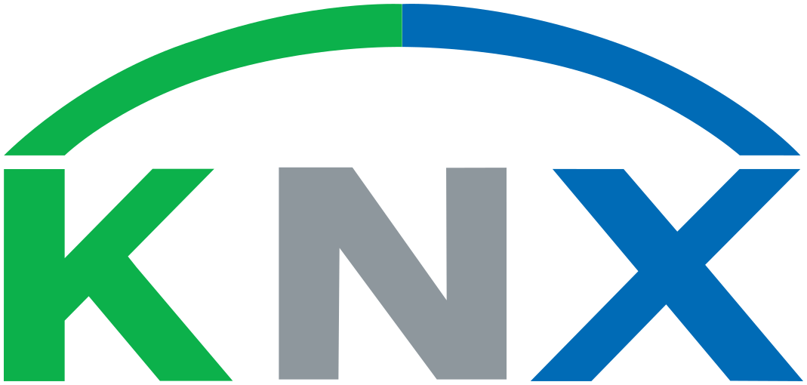

<p align="left">
  <a href="https://iotbench.org/">
    
  </a>
</p>

<h1 align="center">IDC4Delphi</h1>

<p align="center">
  <strong>Industrial Direct Communications for **Delphi®** (IDC4Delphi)</strong> is an open-source initiative, part of the <a href="https://iotbench.org">IoTBench</a> project, aiming to bridge the gap between automation engineers and software developers. By providing a comprehensive set of tools and components, IDC4Delphi empowers the Industrial Internet of Things (IIoT) ecosystem to scale faster and more efficiently.
</p>

<p align="center">
  <a href="https://github.com/IoTBench-org/IDC4Delphi">
    
  </a>
</p>

## Table of Contents

- [Table of Contents](#table-of-contents)
- [About](#about)
- [Features](#features)
- [Supported Protocols](#supported-protocols)
- [Installation](#installation)
- [Usage](#usage)
- [Logos and Trademarks](#logos-and-trademarks)
- [Contributing](#contributing)
- [License](#license)

## About

IDC4Delphi offers a collection of tools and libraries that make it easier for both software developers and automation engineers to work together by facilitating seamless communication with industrial hardware and protocols. By using IDC4Delphi, developers can focus more on building automation solutions without worrying about the low-level details of protocol implementation.

## Features

- **Cross-Protocol Support**: IDC4Delphi supports a wide range of industrial protocols, including Modbus, KNX, MQTT, and more.
- **Multithreaded Processing**: Utilize multithreading capabilities to handle multiple devices and processes concurrently.
- **Easy-to-Use Components**: Provides ready-made Delphi components that simplify IIoT development.
- **Fully Standalone Components**: IDC4Delphi components are completely standalone and do not require any third-party utilities or tools.
- **Open-Source and Extensible**: Completely free to use, modify, and extend under the MIT license.
- **Focus on IIoT Growth**: Created to accelerate the adoption and development of Industrial IoT.

## Supported Protocols

| Protocol                                         | Format Name   | Description                                | Status                                      |
|----------------------------------------------|----------------|--------------------------------------------|-------------------------------------------------------|
|      | **KNX** KNXnet/IP        | Standard for building automation.          |  |
|   | **Modbus** TCP     | Industrial protocol for serial communication.  |  |
|   | **MQTT** Client     | A lightweight messaging protocol often used in IoT for device-to-cloud communication.  |  |

## Installation

1. Clone this repository:

   ```bash
   git clone https://github.com/IoTBench-org/IDC4Delphi.git
   ```

2. Open the project in **Delphi**.

3. Install the necessary dependencies (if applicable).

4. Build the project and include the relevant components in your Delphi applications.

## Usage

To start using IDC4Delphi in your projects, follow these steps:

1. Add the `IDC4Delphi` components to your Delphi project.
2. Choose the communication protocols (e.g., Modbus, KNX, MQTT) that fit your project.
3. Develop automation solutions by connecting the provided components to your industrial devices.

## Logos and Trademarks

This project references several technologies and products, including:
- <div align="left">
    <a href="https://www.embarcadero.com/">
       
    </a>
    <strong>Delphi®</strong> is a product by Embarcadero Technologies. The Delphi logo is a registered trademark of Embarcadero Technologies, Inc. For more information, visit <a href="https://www.embarcadero.com/">Embarcadero's website</a>.
  </div>

- <div align="left">
    <a href="https://www.knx.org/">
       
    </a>
    <strong>KNX®</strong> is a standard for building automation, maintained by the KNX Association. The KNX logo is a registered trademark of KNX Association. For more information, visit <a href="https://www.knx.org/">KNX Association's website</a>.
  </div>

When using these logos, please ensure that you comply with the respective trademark usage policies of each company.

## Contributing

We welcome contributions from the community! Here’s how you can help:

1. Fork this repository.
2. Create a new branch:
   ```bash
   git checkout -b feature/my-new-feature
   ```
3. Commit your changes:
   ```bash
   git commit -m 'Add some feature'
   ```
4. Push to the branch:
   ```bash
   git push origin feature/my-new-feature
   ```
5. Open a Pull Request.

Please refer to the [CONTRIBUTING.md](CONTRIBUTING.md) file for detailed contribution guidelines.

## License

This project is licensed under the MIT License. See the [LICENSE](LICENSE) file for more information.
