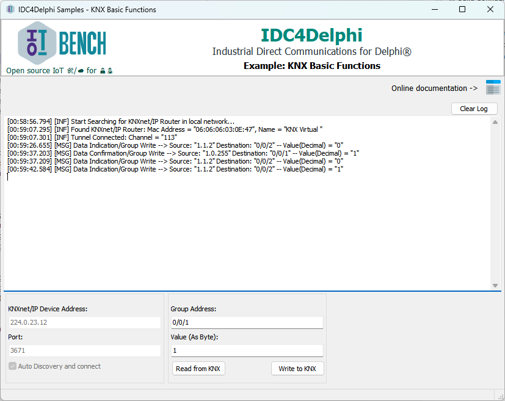

# Prebuilt Demos

We ship some prebuild samples apps explain how IDC4Delphi will be useful in many diffrent scenarios.

All those demos are built on Delphi and can find it's source code on same repository.

## KNX Samples

KNX Basic Functions

Demostration how to use KNX driver in low level and most fast way.

<mark style="color:orange;">Demo functions:</mark>&#x20;

* Auto discovery KNX IP device.
* Connect to the device.
* Write group address values KNX telegrams (raw values).
* Read group address values KNX telegrams (raw values).

<mark style="color:orange;">Source code:</mark> [Github](https://github.com/IoTBench-org/IDC4Delphi/tree/afa121a0eafc32d921d745996970786e7c9fa873/src/Examples/KNX/Basic%20Functions)

<mark style="color:orange;">Download exe:</mark> [Github](https://github.com/IoTBench-org/IDC4Delphi/blob/afa121a0eafc32d921d745996970786e7c9fa873/src/Examples/Bin/KNX\_BasicFunctions.exe)

